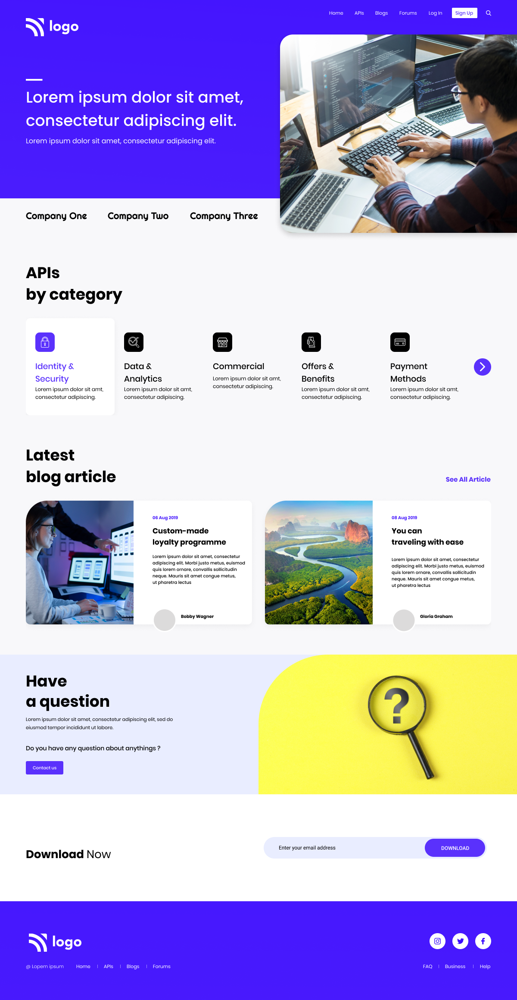

# Project 9

<!-- ## Project 9 [Live Link](https://live-proj-9.netlify.app) -->

-   Skills Gained in this project
    -   Learned various flexbox properties.
    -   Learned about attribute selectors.

---

## Time taken to finish this project

-   4.5 hour taken to complete it.

# Preview

